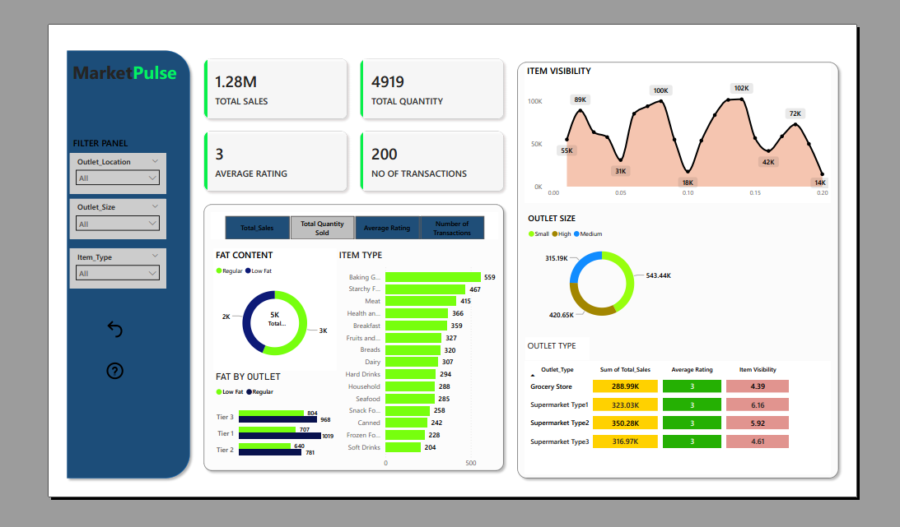

# 🛒 Retail Sales Performance Dashboard

This project is a **Retail Sales Performance Dashboard** built in **Power BI**.  
It analyzes retail sales data and presents key metrics (KPIs) with interactive charts for better decision-making.  
Designed as part of my portfolio to showcase **business intelligence** and **data visualization** skills.

---

## 🔑 Key Features
- **KPIs at a glance:**
  - 💰 Total Sales
  - 📦 Total Quantity Sold
  - ⭐ Average Rating
  - 🛍️ Number of Transactions
- **Interactive Visuals:**
  - Sales by Product Category
  - Sales by Outlet Size & Location
  - Sales by Fat Content
  - Sales by Outlet Establishment
  - Sales Trends over Time
- **User-friendly design:** Clean layout, cards for KPIs, charts for insights.

---

## 📂 Files in this Repository
- `Retail_Sales_Dashboard.pbix` → Power BI dashboard (open with Power BI Desktop).  
- `Sales_Data.xlsx` → Sample dataset used in this project.  
- `dashboard.png` → Screenshot of the dashboard preview.  

---

## 🚀 How to Use
1. Download the files from this repo.  
2. Open `Retail_Sales_Dashboard.pbix` in **Power BI Desktop**.  
3. Explore the visuals and interact with the filters.  
4. Alternatively, view the `PNG` screenshot if you don’t have Power BI.

---

## 🎯 Purpose
This dashboard is built to demonstrate:
- How raw retail data can be transformed into **actionable insights**.  
- Application of **KPIs, DAX measures, and visuals** in Power BI.  
- Skills in **data analysis, dashboard design, and storytelling with data**.  

---

## 📸 Dashboard Preview

---

## 📌 Author
👤 Kumbukani Mkwala
💼 Aspiring Data Analyst | Business Intelligence Enthusiast  
🔗 Connect with me on [LinkedIn](https://www.linkedin.com/in/kumbukani-mkwala/)  
